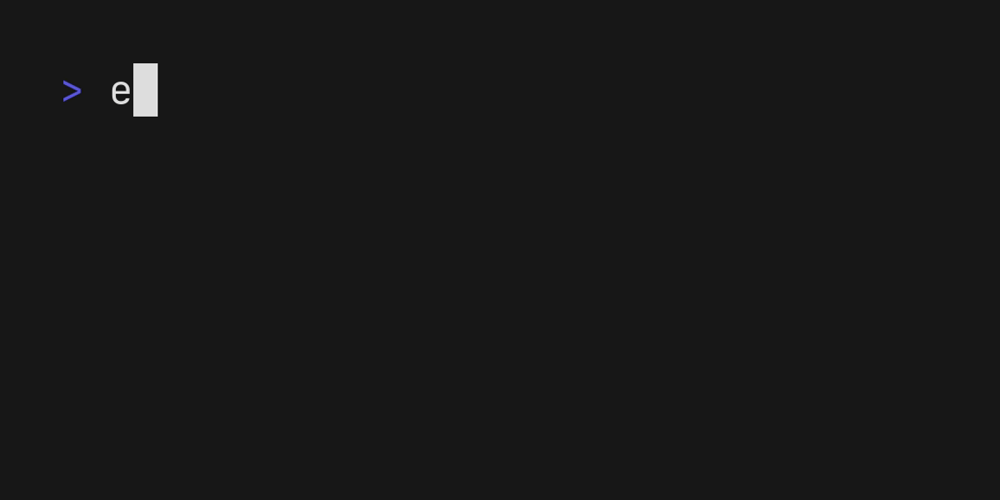

[](https://www.producthunt.com/posts/ai-commit-2)


[](https://youtu.be/7cVU3BuNpok)

[View Demo](https://youtu.be/7cVU3BuNpok)


# AI Commit (Python Fork)

This is a Python fork of [nguyenvanduocit/ai-commit](https://github.com/nguyenvanduocit/ai-commit), converted from Go to Python and modified to use Amazon Bedrock through LiteLLM proxy instead of OpenAI directly.

[View Original Demo](https://youtu.be/7cVU3BuNpok)

## Changes from Original

- Rewritten in Python for better accessibility and easier modification
- Uses Bedrock Claude 3 model through LiteLLM proxy instead of OpenAI
- Enhanced error handling and diff truncation for large changes
- Simplified installation process (no Go required)
- Maintains all original functionality and CLI interface

## Features

- 🤖 AI-powered commit message generation using Bedrock Claude 3
- 📝 Follows conventional commit format
- 🔄 Interactive mode for reviewing and editing messages
- 🚀 Automatic staging, committing, and pushing
- 🏷️ Automatic tag creation
- 🎨 Colorful terminal output

## Installation

1. Clone this repository:
```bash
git clone https://github.com/yourusername/ai-commit-bedrock.git
cd ai-commit-bedrock
```

2. Install dependencies:
```bash
pip install -r requirements.txt
```

3. Set up your environment variables:
```bash
export LITELLM_API_KEY=your_api_key
```

Optional environment variables:
- `AI_COMMIT_MODEL`: Change the AI model (default: bedrock/anthropic.claude-3-sonnet-20240229-v1:0)
- `AI_COMMIT_SYSTEM_PROMPT`: Customize the system prompt for commit message generation

## Configuration

The tool uses a configuration file for customizable settings. Create a `config.json` file in the root directory:

```json
{
    "litellm_endpoint": "your_litellm_proxy_url",
    "default_model": "bedrock/anthropic.claude-3-sonnet-20240229-v1:0",
    "max_diff_length": 6000,
    "max_tokens": 500,
    "temperature": 0.7
}
```

If no `config.json` is found, the tool will use default values from `config.default.json`.

Environment variables:
- `LITELLM_API_KEY`: Your LiteLLM API key (required)
- `AI_COMMIT_MODEL`: Override the model from config (optional)
- `AI_COMMIT_SYSTEM_PROMPT`: Custom system prompt (optional)

## Usage

Basic usage:
```bash
python main.py
```

Options:
- `-h, --help`: Show help message
- `-a, --auto-commit`: Automatically stage and commit changes
- `-t, --auto-tag`: Automatically create a tag
- `-p, --auto-push`: Automatically push changes

Example with all options:
```bash
python main.py -a -t -p
```

## Building Executable

To create a standalone executable:

```bash
pip install pyinstaller
pyinstaller --onefile main.py --name ai-commit
```

The executable will be created in the `dist` directory. You can then move it to your PATH:
```bash
sudo mv dist/ai-commit /usr/local/bin/
```

## Commit Message Format

The tool generates commit messages following the conventional commit format:
```
<type>(<scope>): <description>
```

Types:
- feat: New feature
- fix: Bug fix
- docs: Documentation changes
- style: Code style changes
- refactor: Code refactoring
- test: Adding or modifying tests
- chore: Maintenance tasks
- perf: Performance improvements

## Credits

This project is a fork of [nguyenvanduocit/ai-commit](https://github.com/nguyenvanduocit/ai-commit). The original tool was written in Go and used OpenAI's API directly. This fork converts the codebase to Python and modifies it to use Amazon Bedrock through LiteLLM proxy.

Special thanks to:
- [@duocdev](https://twitter.com/duocdev) for creating the original ai-commit tool
- [LiteLLM](https://github.com/BerriAI/litellm) for providing the proxy that enables easy integration with various AI models

## License

This project is licensed under the MIT License - see the [LICENSE](LICENSE) file for details.

## Contributing

Contributions are welcome! Please read [CONTRIBUTING.md](CONTRIBUTING.md) for details on our code of conduct and the process for submitting pull requests.

[](https://twitter.com/duocdev)
